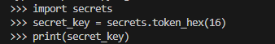

# ucdpa_python_project

On Render
Link to deployment
https://ucdpa-python-project.onrender.com/

Portfolio Dashboard Flask Application
Overview
This is a Flask-based web application that allows users to manage a portfolio of stocks. The application enables users to add, remove, and view stocks in their portfolio. Additionally, the application fetches real-time stock prices and other data points (e.g., ISIN) using Yahoo Finance.

Features
User Authentication: Secure login and session management.
Portfolio Management: Add, remove, and view stocks in your portfolio.
Real-time Data: Fetch live stock data using Yahoo Finance.
Responsive UI: A Bootstrap-based responsive interface that adapts to different screen sizes.
Prerequisites
Before running this application, ensure you have the following installed:

Python 3.x
pip

Installation
1. Clone the Repository
    git clone https://github.com/yourusername/portfolio-dashboard.git
    cd portfolio-dashboard
2. Create and Activate a Virtual Environment
    Create a virtual environment to manage dependencies:
    python -m venv venv

        Activate the virtual environment:
            Windows:
            venv\Scripts\activate

            macOS/Linux:
            source venv/bin/activate

3. Install Dependencies
    Install all required Python packages using requirements.txt:
    pip install -r requirements.txt

4. Set Up Environment Variables
    Create a .env file in the root directory of the project and add the following environment variables:

makefile

FLASK_APP=app.py
FLASK_ENV=development
SECRET_KEY=your_secret_key_here

5. Initialize the Application
You may need to initialize some data or perform migrations (if applicable). If not, you can skip this step.

6. Run the Application
Start the Flask development server:

bash

flask run
Open your browser and go to http://127.0.0.1:5000 to access the application.

Application Structure
app.py: The main Flask application file containing route definitions.
templates/: HTML templates for rendering web pages.
static/: Static files such as CSS, JavaScript, and images.
requirements.txt: A list of all dependencies needed to run the application.
.env: Environment variables for configuration (should be created manually). Included in Zip file
Key Routes
/: Home page or landing page.
/login: User login page.
/dashboard_1: User's portfolio dashboard.
/add_stock: Add a new stock to the portfolio (POST only).
/remove_stock/<string:stock_code>: Remove a stock from the portfolio.
Debugging

Points to Note
The application defaults to using 'off' for yf_flag if not provided. 
This toggle is controlled tith the Y! switch on the Dashboard(e.g., when adding stocks).
If this is set To ON the Application Will refresh all prices in the Portfolio when a new Stock is added
Alternatively you can leave it  off  , Add All stocks  -  And use the Refresh Prices Button
I note that storing the user data , passwords and portfolio information should be stored in database and not locally on json
This will be future functionality in SQL module.

A Sample Stock list is loaded As drop down using a .json File As input for DEMO purposes to make ease of use.

7. Future functionality  - 

Take the Stop Loss and Profit Price and evaluate these compared to the market price from Yahoo Finance showing user the current position.

Enhance functionality of The refresh prices to fetch all stocks at once
Move user details to SQL DB in PostgrSQL

